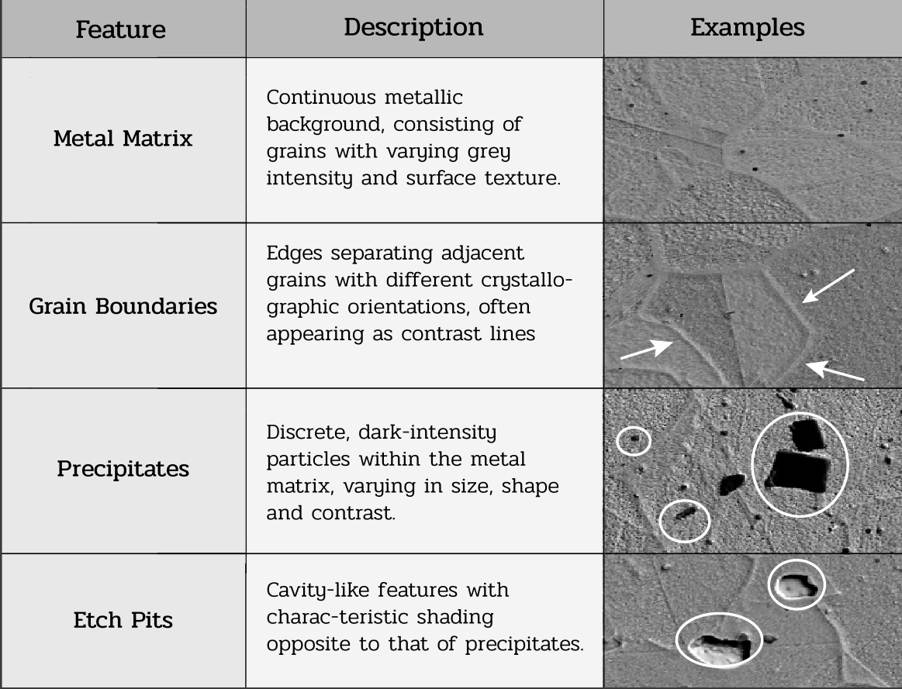
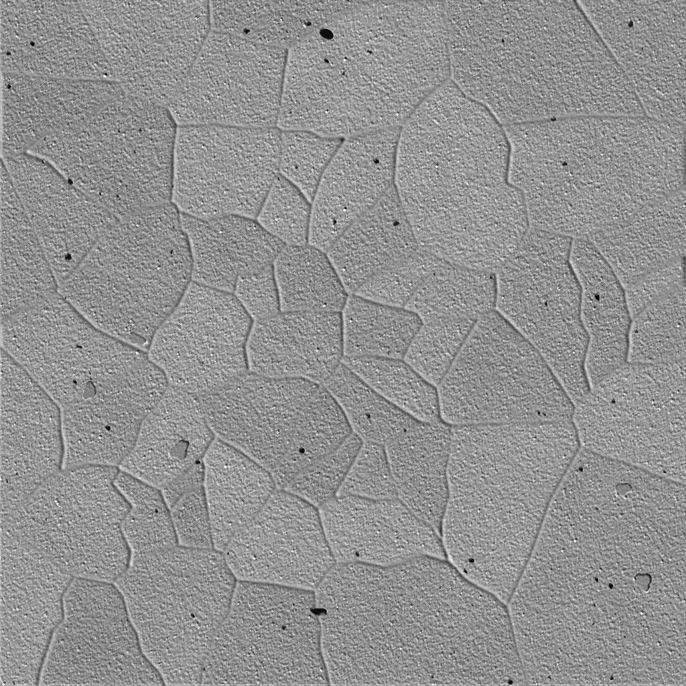
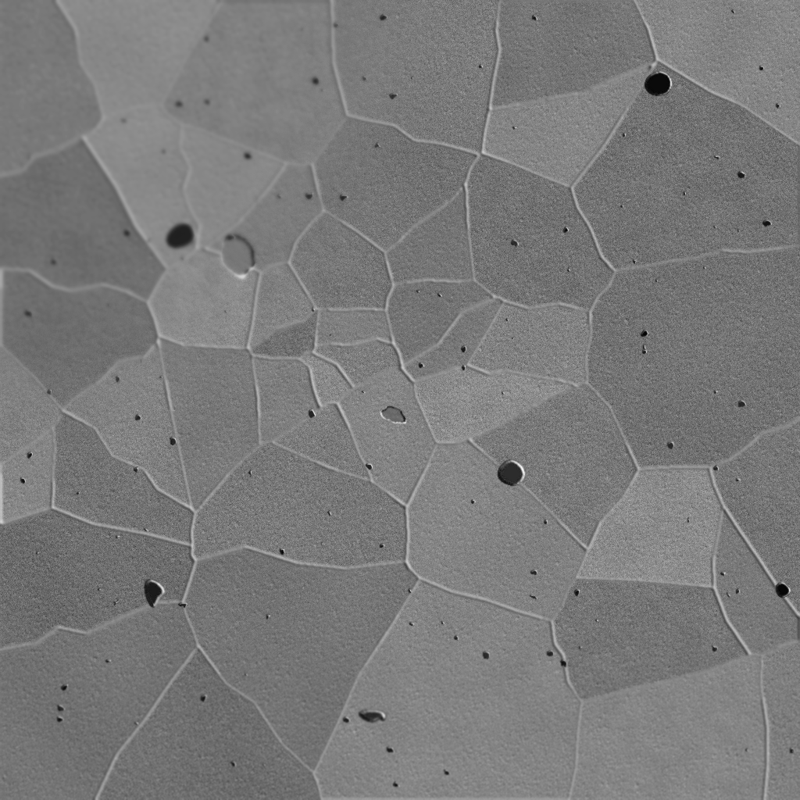
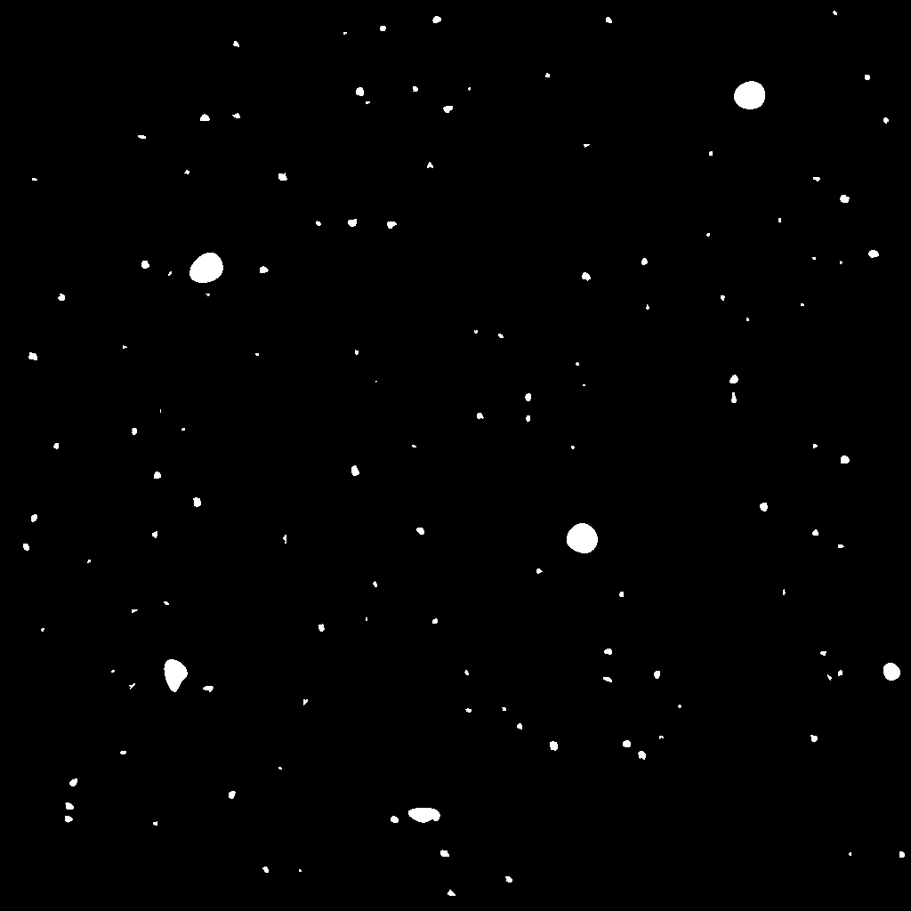
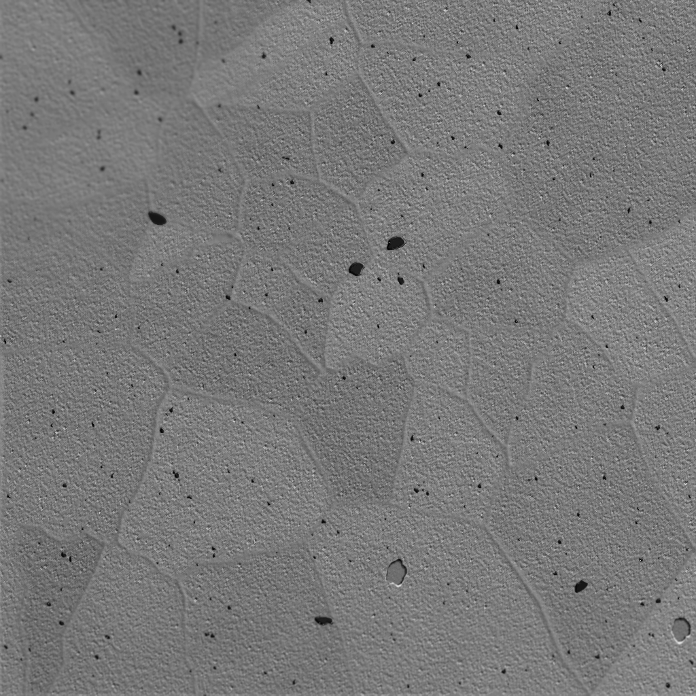
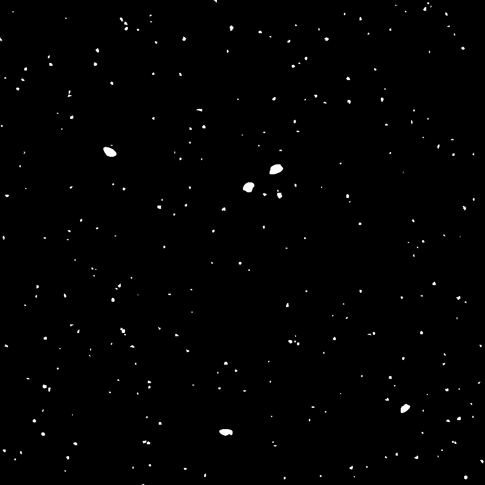

# Synthetic Image Generator Project

## Overview

This project implements a configurable generator of synthetic grayscale microstructure images resembling scanning electron microscopy (SEM) images of stainless steel, together with corresponding binary segmentation masks.

It was developed to support experiments in precipitate segmentation when annotated microscopy data is limited. It can also be used to study how specific image properties affect segmentation model training.

## Image Generation Components

The generator simulates several features commonly found in metallic microstructures.
<p align="center">
  
</p>

### Matrix

The background is generated as a grain-like structure based on Voronoi tessellation, with configurable:

- Number of grains
- Grayscale intensity range
- Border width
- Border irregularity
- Shading
- Perlin and Gaussian texture noise

### Precipitates

Precipitates are generated as small, dark, irregular objects with configurable:

- Number
- Size range
- Size distribution
- Intensity
- Local shading

### Etch Pits

Etch pits are generated as recessed elliptical features with configurable:

- Number
- Size range
- Intensity range
- Shading

## Generated Outputs

Each generated sample contains:

- `img.png` — synthetic grayscale microstructure image
- `mask.png` — binary segmentation mask for precipitates
- `metadata.json` — metadata describing the generation parameters

Image size and dataset size are configurable.

Generation is controlled through JSON configuration files. Randomness is handled through explicit seeds to support reproducible dataset generation.

## Synthetic Generation Examples

The generator produces synthetic grayscale microstructure images together with corresponding binary segmentation masks. The masks provide pixel-level labels for precipitate segmentation.

The examples below show three generated samples and their corresponding masks.

### Example 1

<table>
  <tr>
    <th>Synthetic Image</th>
    <th>Segmentation Mask</th>
  </tr>
  <tr>
    <td align="center">
      
    </td>
    <td align="center">
      
    </td>
  </tr>
</table>

### Example 2
<table>
  <tr>
    <th>Synthetic Image</th>
    <th>Segmentation Mask</th>
  </tr>
  <tr>
    <td align="center">
      
    </td>
    <td align="center">
      
    </td>
  </tr>
</table>

### Example 3
<table>
  <tr>
    <th>Synthetic Image</th>
    <th>Segmentation Mask</th>
  </tr>
  <tr>
    <td align="center">
      
    </td>
    <td align="center">
      
    </td>
  </tr>
</table>

## Typical Use

A typical workflow consists of:

1. Editing a configuration file to define the desired image properties.
2. Generating a synthetic dataset.
3. Using the generated images and masks to train a segmentation model.
4. Evaluating model performance on real microscopy images.

Since the images are synthetic, performance on real data should be evaluated separately.

## Example Usage

The generator logic is exposed through the `generate()` function in `main.py`.

Generation parameters are defined through JSON configuration files. See the `config/` directory for the available configurations.


## Requirements

- Python 3.10 or 3.11

Install the required dependencies:

```bash
pip install -r requirements.txt
```
